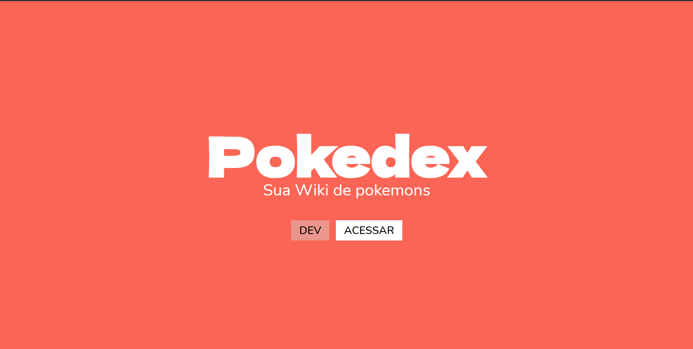
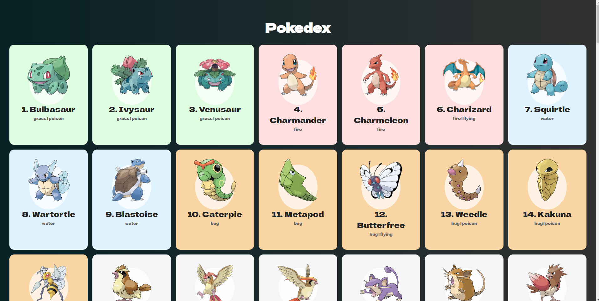
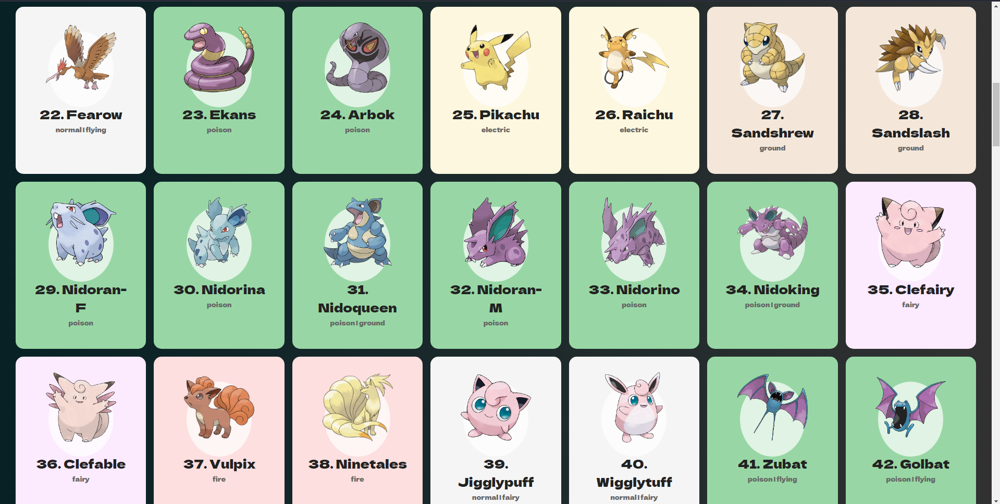

  <h1 align="center" > 
    
    PokeDex - V1 </h1> 
  
  
Print Aplicação

 
 
 

  
<h1>💻 Visualize</h1>

Visualize está aplicação em https://ulisses97.github.io/Pizzaria-JS/ 

 

<h1>🚀 Tecnologias</h1>
 

Esse projeto é um estudo de Front End usando as seguintes tecnologias:

- ✔️ Javascript  
- ✔️ JSON  
- ✔️ HTML  
- ✔️ CSS  

<h1>📝Versão</h1>

Essa aplicação encontra-se na versão 1 preste a receber novos estilos de CSS

 

 

<h1>ℹ️ Como usar</h1>

<pre>

# Clone o repositorio
$ git clone https://github.com/Ulisses97/pokedex.git

# Puxe o repositorio 
$ cd Pizzaria-JS

# Execute o arquivo
$ com a extensão Live Serve do VScode, você poderá rodar essa aplicação sem erros.

<footer>
Feito com o ♥ por <a href="https://www.instagram.com/ulisses.brandao/">Ulisses Brandão</a>👋
  

☕Bora tomar um café e conversar melhor?
</footer>
